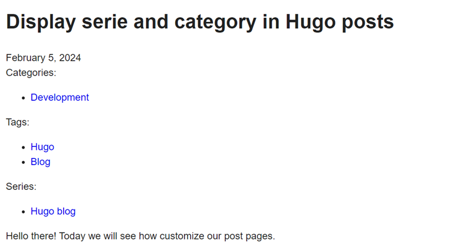
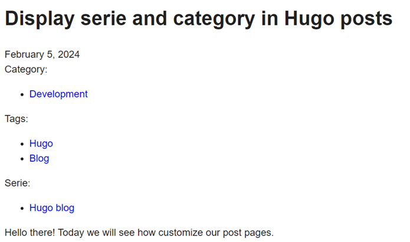

Hello there! Today we will see how customize our post pages.  
By default the tags are displayed, but I would like to see the category and the serie as well.

## How it works

Hugo use templates to render the website, see https://gohugo.io/templates/

The two main templates are single page and list page : a post is a single page but the post section is a list page, it will render a list of content.

First let's read the documentation :
* Base of templating : https://gohugo.io/templates/introduction  
  It will help understand the base templates when reading them
* How the template is selected : https://gohugo.io/templates/lookup-order  
  In order to replace only what we need at the correct scope
* How single page templates work : https://gohugo.io/templates/single-page-templates  
* The go framework behind Hugo templating : https://pkg.go.dev/text/template

I will try to summarize how it goes in the case of a blog post :
1. The kind of page (home, single page, list) is defined
1. Get the layout, based on section (first sub folder of content) or front matter properties
1. Check as well format, language, and whatever else
1. Look in the *layouts* folder of the web site, then in the theme to find the template  
   Whatever is in the website level overrides what is in the theme
   1. In *layouts*, use the a template in *_default* if anything more specific is found
   1. In *layouts*, based on the layout computed for the page, search a folder of the layout name  
      By default the same as the section
      If layout is overriden in front matter, a folder of the specified layout, that way you can defined some specific rendering if you need for some content
   1. Those *main* layouts can use *partials* to delegate the rendering of some parts  
      We can find the *partial template* in the *partials* folder (not too hard xD)  
      If we look at the *single.html* content in *_default*, we can see the tags rendering is delegated to the partial *terms.html*
    1. In *single.html* we can also see `{{ define "main" }}` block  
       To understand why we need that, open *baseof.html* in *_default*  
       That is the main file of the template, it uses *blocks* (like main), partials and defines the main HTML structure  
       The base files can also be overriden, but we won't go that far for now
1. Hugo will compile everything together to generate the post page based on the templates found

## OK so how we add more taxonomy ?

I want category and serie in every blog post, so I will add a custom template for my posts in my theme.
I could add it as well in my website, but the goal while writting thoses posts is also to develop my own reusable Hugo theme.

So in the theme in *layouts*, copy the *single.html* page in *_default* and past it in a new layouts sub folder *posts*.

The basic template is pretty simple :
```
{{ define "main" }}
  <h1>{{ .Title }}</h1>

  {{ $dateMachine := .Date | time.Format "2006-01-02T15:04:05-07:00" }}
  {{ $dateHuman := .Date | time.Format ":date_long" }}
  <time datetime="{{ $dateMachine }}">{{ $dateHuman }}</time>

  {{ .Content }}
  {{ partial "terms.html" (dict "taxonomy" "tags" "page" .) }}
{{ end }}
```

I want the category and the serie, and I want them before the content, so edit the template as below : 
```
{{ define "main" }}
  <h1>{{ .Title }}</h1>

  {{ $dateMachine := .Date | time.Format "2006-01-02T15:04:05-07:00" }}
  {{ $dateHuman := .Date | time.Format ":date_long" }}
  <time datetime="{{ $dateMachine }}">{{ $dateHuman }}</time>

  {{ partial "terms.html" (dict "taxonomy" "categories" "page" .) }}
  {{ partial "terms.html" (dict "taxonomy" "tags" "page" .) }}
  {{ partial "terms.html" (dict "taxonomy" "series" "page" .) }}

  {{ .Content }}
{{ end }}
```

Like we saw, the taxonomy is rendered thanks to a partial *terms.hml*. We reuse it to add our other taxonomy values in the page.

Let's see how it looks :  


## Nouns are plural!

The rendering is fine, but nouns are plural. We know we will only set one category and serie at a time. Let's fix this.

For that part I choose to directly edit the partial *terms.html*.

The partial is called with that code : `{{ partial "terms.html" (dict "taxonomy" "categories" "page" .) }}`  
Data are passed using a dictionnary, so let's add the label we want in the dictionnart : `{{ partial "terms.html" (dict "taxonomy" "categories" "page" . "label" "Category") }}`

Now in the *terms.html* file, the data are available in the current context. The terms partial store them :.
```
{{- $page := .page }}
{{- $taxonomy := .taxonomy }}
```

The label is initially defined like this : `{{- $label := (index . 0).Parent.LinkTitle }}`

I want that to still be the default behaviour if no label is defined when calling the partial. For that I used the [default](https://gohugo.io/functions/compare/default/) function :  
`{{- $label := default (index . 0).Parent.LinkTitle $.label }}`

The final code :
```
{{- /*
For a given taxonomy, renders a list of terms assigned to the page.

@context {page} page The current page.
@context {string} taxonomy The taxonony.
@context {string} label The block label.

@example: {{ partial "terms.html" (dict "taxonomy" "tags" "page" .) }}
@example: {{ partial "terms.html" (dict "taxonomy" "tags" "page" . "label" "Authors") }}
*/}}

{{- $page := .page }}
{{- $taxonomy := .taxonomy }}

{{- with $page.GetTerms $taxonomy }}
  {{- $label := default (index . 0).Parent.LinkTitle $.label }}
  <div class="taxonomy">
    <div class="label">{{ $label }}:</div>
    <ul>
      {{- range . }}
        <li><a href="{{ .RelPermalink }}">{{ .LinkTitle }}</a></li>
      {{- end }}
    </ul>
  </div>
{{- end }}
```

And it looks like that :  


The next post will explain how add the post date in our tags, catagories and series list pages.  
Stay tuned!
