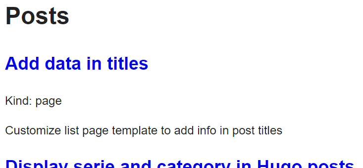
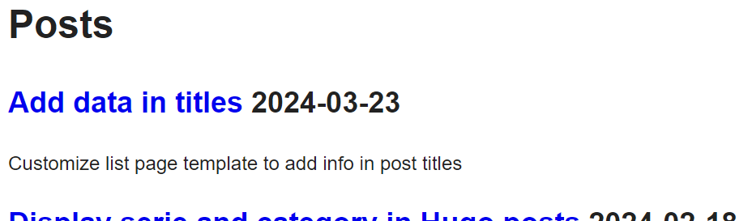
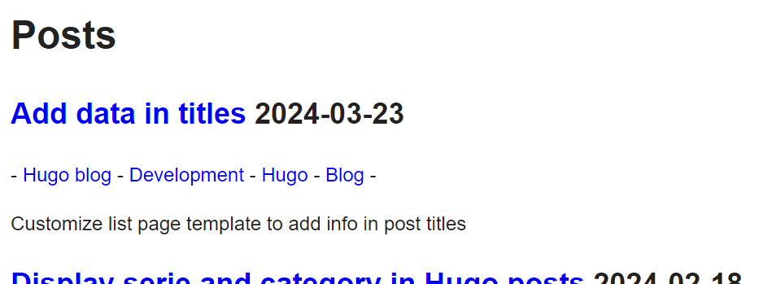
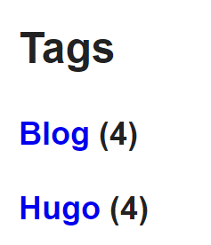

Hello there! Today we will dig in the list template to add data in our titles.

## First, test it !

To know what you can do, just test and try to debug the available data you have.
Here the link with the page properties : https://gohugo.io/methods/page

The defalut list template is in your theme in *layouts/_default/list.html* folder.  
Edit the template to display the page kind for example :

```html
{{ define "main" }}
  <h1>{{ .Title }}</h1>
  {{ .Content }}
  {{ range .Pages }}
    <h2><a href="{{ .RelPermalink }}">{{ .LinkTitle }}</a></h2>
    <p><span>Kind: {{ .Kind }}</span></p>
    <p>{{ .Summary }}</p>
  {{ end }}
{{ end }}
```

The home page is not affected by that template.  
The taxonomy pages (tags, categories, series) and posts page are affected, see below :  
  


Try out other properties to see what you can get !

## Display the date only for pages

So to add the date for posts, I just add a new span when the kind is *page*.

```html
{{- define "main" }}
  <h1>{{ .Title }}</h1>
  {{- .Content }}
  {{- range .Pages }}
    <h2 class="list-title">
      <a href="{{ .RelPermalink }}">{{ .LinkTitle }}</a>
      {{- if eq "page" .Kind }}
        <span class="date">{{ .Date.Format "2006-01-02" }}</span>
      {{- end }}
    </h2>
    <p>
      {{ .Summary }}
    </p>    
  {{- end }}
{{- end }}
```



Find details about date format here : https://gohugo.io/functions/time/format

For taxonomy pages, I have a better idea ^_^

## Display taxonomy for pages

In addition of the date, what if we could see the taxonomy associated with the page to help to know what the page is about ?

Between the title and the summary, let's add a paragraph with the page taxonomy.

```html
{{- define "main" }}
  <h1>{{ .Title }}</h1>
  {{- .Content }}
  {{- range .Pages }}
    <h2 class="list-title">
      <a href="{{ .RelPermalink }}">{{ .LinkTitle }}</a>
      {{- if eq "page" .Kind }}
        <span class="date">{{ .Date.Format "2006-01-02" }}</span>
      {{- end }}
    </h2>
    {{- if eq "page" .Kind }}
      {{- $tags := .GetTerms "tags" }}
      {{- $category := .GetTerms "categories" }}
      {{- $serie := .GetTerms "series" }}
      {{- $taxonomy := union $serie (union $category $tags) }}
      {{- if ($taxonomy.Len | lt 0) }}
        <p>
          {{- range $taxonomy }}
            - <a href="{{ .RelPermalink }}">{{ .LinkTitle }}</a>
          {{- end }}
          -
        </p>
      {{- end }}
    {{- end }}
    <p>
      {{ .Summary }}
    </p>    
  {{- end }}
{{- end }}
```



Thanks to the *GetTerms* page method, we get all the taxonmy. Then we set all the values in one list with the union function.
Finally if there are terms, we list then inside a paragraph.

## Display the number of pages for terms

For terms having the post date has no sense. Instead I would like to have the number of pages for that term.  
I use the *urlize* function to get the taxonomy key in order to retrieve the data about the term.  
The *index* function is used to get the term from the collection by its key.  
Then the count is already accessible from the term, just display it next the title.

```html
{{- define "main" }}
  <h1>{{ .Title }}</h1>
  {{- .Content }}
  {{- range .Pages }}
    <h2 class="list-title">
      <a href="{{ .RelPermalink }}">{{ .LinkTitle }}</a>
      {{- if eq "page" .Kind }}
        <span class="date">{{ .Date.Format "2006-01-02" }}</span>
      {{- end }}
      {{- if eq "term" .Kind }}
        {{- $taxo := index site.Taxonomies ($.Title | urlize)}}
        <span class="count">({{ $taxo.Count (.Title | urlize) }})</span>
      {{- end }}
    </h2>
    {{- if eq "page" .Kind }}
      {{- $tags := .GetTerms "tags" }}
      {{- $category := (.GetTerms "categories").Limit 1 }}
      {{- $serie := (.GetTerms "series").Limit 1 }}
      {{- $taxonomy := union $serie (union $category $tags) }}
      {{- if ($taxonomy.Len | lt 0) }}
        <p>
          {{- range $taxonomy }}
            - <a href="{{ .RelPermalink }}">{{ .LinkTitle }}</a>
          {{- end }}
          -
        </p>
      {{- end }}
    {{- end }}
    <p>
      {{ .Summary }}
    </p>    
  {{- end }}
{{- end }}
```



See  
https://gohugo.io/functions/collections/indexfunction  
https://gohugo.io/functions/urls/urlize

## Home is not affected

Home page is not affected by the list template. For now I will let the page almost untouched, I just limit the number of results to the last 5 posts.

I change the *layouts/_default/home.html* template by :


```html
{{ define "main" }}
  {{ .Content }}
  {{ range site.RegularPages.Limit 5 }}
    <h2><a href="{{ .RelPermalink }}">{{ .LinkTitle }}</a></h2>
    <p>{{ .Summary }}</p>
  {{ end }}
{{ end }}

```

I just added *.Limit 5* to in the range operation.


I hope you learn something with that post, the next one will be about managing the translation of posts.  
Stay tuned!
