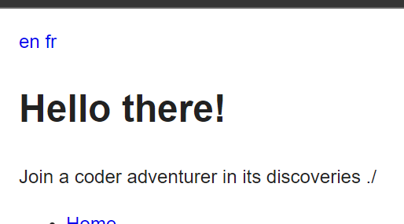
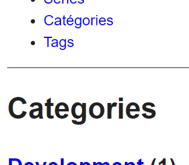

## Documentation

Let's start by the official documentation : https://gohugo.io/content-management/multilingual

Those blog posts can help us too :
* https://www.regisphilibert.com/blog/2018/08/hugo-multilingual-part-1-managing-content-translation
* https://www.regisphilibert.com/blog/2018/08/hugo-multilingual-part-2-i18n-string-localization

## Configure another language

Set our default language to english and add the french language, in the hugo.yaml file of our site (not the theme) add :

```yaml
languageCode: en
title: Hello there!

languages:
  en:
    weight: 1
    description: Join a coder adventurer in its discoveries ./
  fr:
    weight: 2
    params:
      description: Rejoins un aventurier du code dans ses découvertes ./
```

The title is the same whatever the language but we set a translated description.

## Display the description

The description is not displayed by default, let's display it in our theme!
Open the file *layouts/partials/header.html*, then add the following paragraph below the title :
```html
<p>{{ .Param "description" }}</p>
```

## Links to the different languages

We see the description but we cannot change the language except by writing ourselve the url...  
Edit again the file *layouts/partials/header.html* to add links to the home pages for each language.
At the top of the file, add :
```html
<div>
    {{- range $.Site.Home.AllTranslations }}
    <a href="{{ .RelPermalink }}">{{ .Language.Lang }}</a>
    {{- end }}
</div>
```



Click on each to see the description changes!

## Manage menus

If we click on a menu item, the link is for the default language, even if we are on a french page. Let's fix that.

Check the documentation : https://gohugo.io/content-management/multilingual/#menus

In my case I define my menu in the *hugo.yaml* file, so I have to add a translated menu in the french language settings.  
*Remark : we could have complete different menu from a language to another!*

```yaml
languages:
  en:
    weight: 1
    params:
      description: Join a coder adventurer in its discoveries ./
  fr:
    weight: 2
    params:
      description: Rejoins un aventurier du code dans ses découvertes ./
    menus:
      main:
        - name: Accueil
          pageRef: /
          weight: 10
        - name: Articles
          pageRef: /posts
          weight: 20
        - name: Séries
          pageRef: /series
          weight: 30
        - name: Catégories
          pageRef: /categories
          weight: 40
        - name: Mots clés
          pageRef: /tags
          weight: 50
```

*Remark : Until some content is translated, the translated version of the site will list any pages.*

## How translate page titles ?

Ok now ours links in french languages link to the french pages of our menu, but the page titles are still in english !



For each section / taxonomy, in the *content* folder, add a folder for each (in my case : *categories*, *posts*, *series*, *tags*).  
In each folder, add an *_index.fr.md* file in order to override the title.  
In each file, add a front matter with the title you want, example for posts :
```yaml
---
title: Articles
---
```

## How translate sections / taxonomy urls ?

Now the titles are correct but the url are still in english. 
I find ways to change the names using permalinks but you have to set it also for default language and I find it difficult to do and to maintain. Personnaly as the language code is added in url for additionnal languages I find it acceptable to keep the end of the url identical and in english. Moreover it is easier as a user to switch language manually from the url that way.

If you still want to change the url for your other languages check the permalinks documentation: 

https://gohugo.io/content-management/urls/#permalinks

## Translate the content !

Now everything should be ready to translate pages.  
If the page is in a page bundle, add a n index page with extension *<LANGUAGE>.md*, example *index.fr.md*
For simple pages, just create a page with the same name but with extension *<LANGUAGE>.md*, example *my-page.fr.md*

After adding your new page, it should be visible in the other langage. For taxonomy, you need to restart your local server to see changes. See each language like an almost independant site when you navigate : titles, links, taxonomy, content are linked but can be different.

## List related translated pages

A cool feature I would like is to have the links to the current page translations.
TODO header
TODO posts single 

It's the end for today, translate your pages and check the links are correct in each language. In my case I have some content to catch up on ^^ Next time we will look at how optimize our images with Hugo.  
Stay tuned !