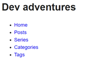
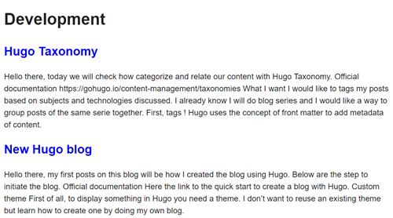
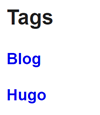
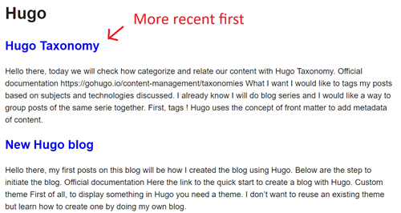
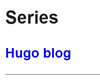

Hello there, today we will check how categorize and relate our content with Hugo Taxonomy.

## Official documentation

https://gohugo.io/content-management/taxonomies

## What I want

I would like to tags my posts based on subjects and technologies discussed.  
I already know I will do blog series and I would like a way to group posts of the same serie together.

## First, tags !

Hugo uses the concept of [front matter](https://gohugo.io/content-management/front-matter) to add metadata of content. By default two types of taxonomy is created for us : tags and categories.

[Here](https://gohugo.io/content-management/taxonomies/#example-front-matter-with-taxonomies) and example of how add categories and tags in your front matter.

For categories I will just use *Development* for now. I will use tags to specify the subjects and technologies discussed in the post.

Personnaly I find it more readable to use the yaml version of the front matter, so my front matter for example for that post is :

``` yaml
---
title: 'Taxonomy'
date: 2024-02-03T00:00:00Z
draft: false
categories:
- Development
tags:
- Hugo
- Blog
---
```

## The series !

For the post series, I will create a custom taxonomy in order to reuse what Hugo provides. I will also use the taxonomy weight to manage the post order in the taxonomy page.

First edit the hugo config to set that taxonomy:

```yaml
taxonomies:
  category: categories
  serie: series
  tag: tags
```

Then edit the posts *front matter* to define the associated serie:

```yaml
series: Hugo blog
series_weight: 1
```

I don't want the default order which consist of displaying items from recent to older but the opposite. So I set the weight starting at 1 and increase by 1 at each post.

## Do it in your site config !

If you change the default taxononmy to add or remove terms, do it in the Hugo config of the site, not in the theme !

I wanted to prepare that organization by default in the theme but the taxonomy config is ignore when running the site :(

## Update the menu

Hugo manage the pages for the taxonomy for us, but we need links to access them ! Add the page links in the menu in the Hugo config file.

*Remark: the site config override the module config, so if you change the menu you have to copy what you want to keep from the module config*

My menu :

```yaml
menus:
  main:
  - name: Home
    pageRef: /
    weight: 10
  - name: Posts
    pageRef: /posts
    weight: 20
  - name: Series
    pageRef: /series
    weight: 30
  - name: Categories
    pageRef: /categories
    weight: 40
  - name: Tags
    pageRef: /tags
    weight: 50
```

## All together

Now that everything is configured, what does it change in the site ?

We now have 3 menu entries to acces all our taxonomy. Our visitors can see the differents tags to have an idea of what content is in the blog. Post series are easely found from the menu as well as our post catgories.

Menu:  


Categories:  


Development category:  


Tags:  


Hugo tag:  


Series:  


Hugo blog serie:  


From posts, only tags are visibles for now. Our next post will show how display the category and serie in the posts.  
Stay tuned !
